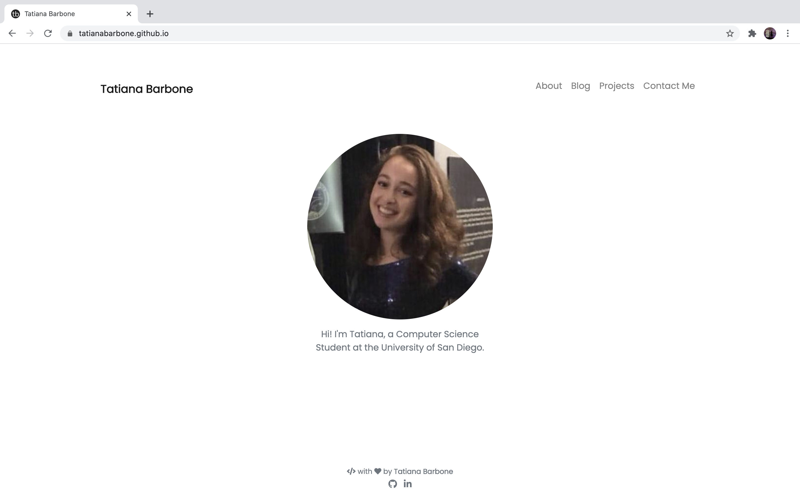
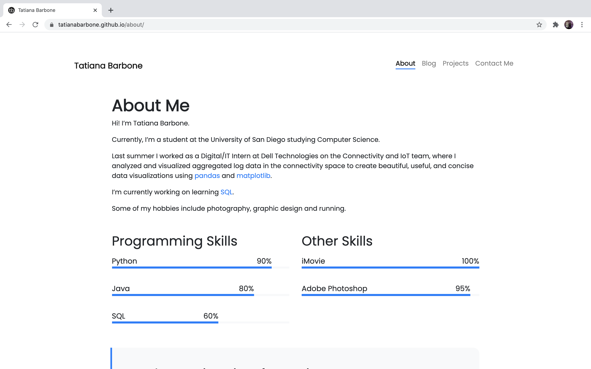
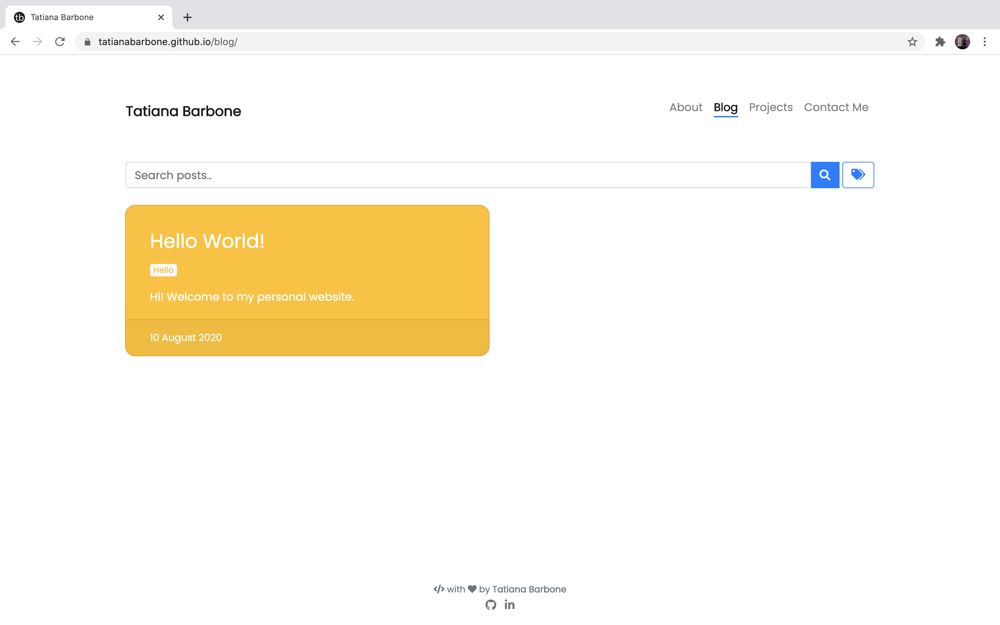
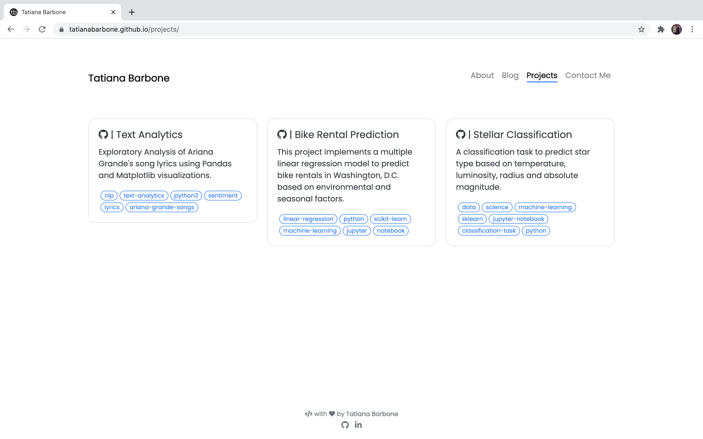
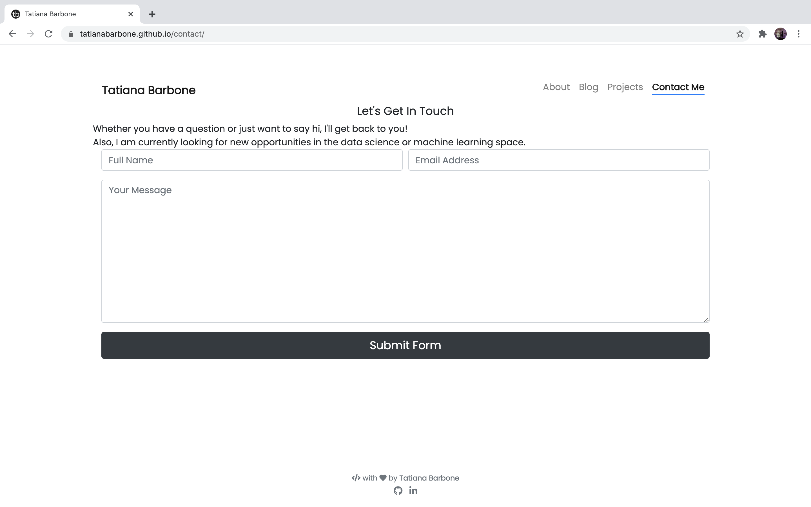
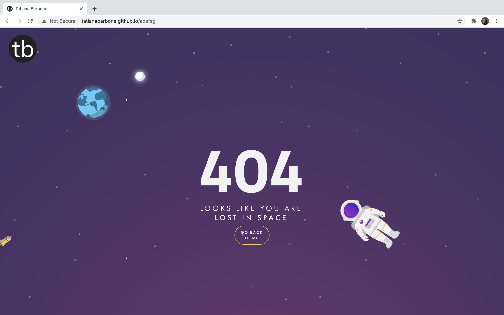

  

<h1 align="center">
  tatianabarbone.github.io
</h1>

  The first iteration of my personal website. Built using <a href="https://www.gatsbyjs.org/" target="_blank">PortfolYOU.</a>

## Features 🛠
- Minimalist design
- [FormSubmit](https://formsubmit.co/)
- Google Analytics Integration
- 404 page from [Saleh Riaz Qureshi](https://codepen.io/salehriaz/pen/erJrZM)

## Screenshot and Design 🖼

- `/`: main page with the sections of `Home`, `About`, `Blog`, `Projects` and `Contact Me`.
- `/404`: error page for unexpected route.

| Section  |           Screenshot            |
| -------- | :-----------------------------: |
| Home     |          |
| About |     |
| Blog |  |
| Projects |    |
| Contact Me |    |
| /404     |            |

